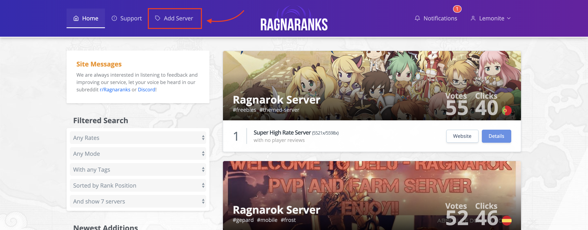
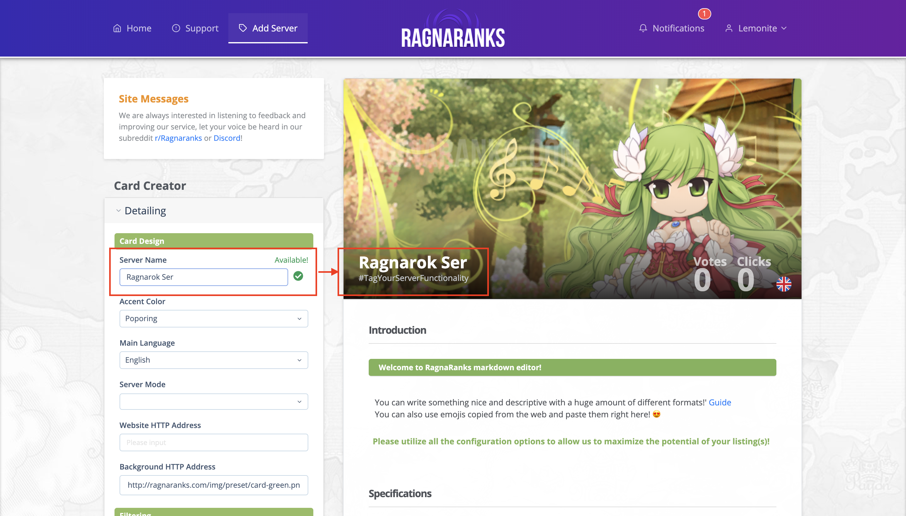
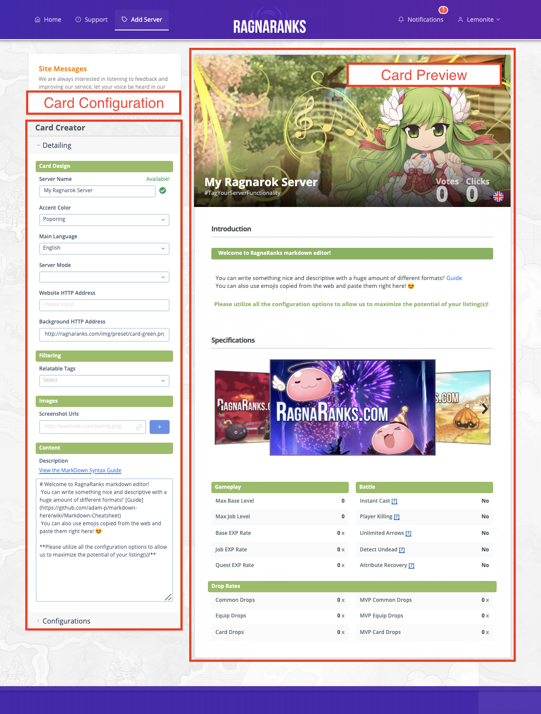
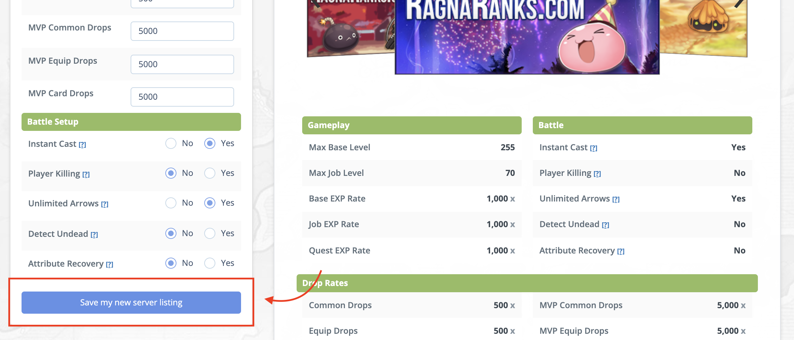

[Back to Index](./index.html)

## Contents
- [Introduction](#introduction)
- [Starting out](#starting-out)
- [Understanding the Layout](#understanding-the-layout)
- [Detailing your card](#detailing-your-card)
- [Completed Detailing Example](#completed-detailing-example)
- [Configuring Your Card](#configuring-your-card)
- [Completed Configuration Example](#completed-configuration-example)
- [Saving your card Listing](#saving-your-new-card)
- [Troubleshooting](#troubleshooting)

## Introduction
One of the main concepts that we would like to introduce to visitors and server owners is the concept of `cards`. A card is another name for your server listing, bundled up and shown alongside others in a presentable card format. We have invested a huge amount of time in making sure that it is enjoyable and easy to both update and create a listing, there is much more we wish to implement in the future and you can incorporate your ideas on your subreddit at [r/ragnaranks](https://www.reddit.com/r/RagnaRanks/) where they will be acted upon and feedback left.

Here we will describe a normal flow of creating a card, the validation messages, required fields and meanings and helping you alongside the process.

## Starting out
- To begin creating your card, you will be required to have an registered account and be logged in, without having a banned status, you can find the `Add Server` option on the top left menu on desktop. 
- You should then be presented with a beautiful layout with some preset colors and background to help you get started, we have made sure that this experience is enjoyable and minimal to help the process be as fast as possible.  
- On first glance it may be unclear, but evidently as you begin to fill out the form you will understand that your changes reflect the preview instantly allowing responsive feedback on how your final card will look 

## Understanding the layout
- There is two parts to major parts the card creator layout, the `left pane` shows all the `configuration` that can be applied to your card and the `right pane` shows the `preview` of your configurations and how the `final layout` will be presented. 

## Detailing your card
- Server name
    - This should be titled by the name of your server, be default an orange exclamation mark is shown to tell you that it is required to be changed from the default.
    - As you type the card configuration validates the input with the server to verify that you are using a unique server name.
    - If you use an invalidated name, you will be presented with an red exclamation mark and the error message.
    - If you use a name that has already been used, you will be presented with a `Already Taken` message and an red exclamation mark, please change your listing name if this happens.
    - There is a green check icon if the name you entered is unique and can be used.
- Accent Color
    - This is the color you want to associate your server with, for example if you wish to associate with the color green make sure to select the color `poporing`.
    - You can instantly see changes to the color scheme once you select a color.
    - You can see a color grid on each available color in the dropdown selection.
- Main Language
    - This should represent the main language of your server and the spoken language.
- Server Mode
    - This is the mode in which your server is running, renewal or pre-renewal are the standard selection, however a custon selection is optional for those who have built something unique. (like pokemon)
- Website HTTP Address
    - The address that visitors/players will be linked to when they decide to check your listing/server out.
    - Each click to the website will count a click towards your server at a rate of `1 per hour`.
    - The clicks are IP Checked
    - Our ranking system should reflect clicks instantly on your listing.
    - It is important that you use the full address `http://example.com` and not `example.com` this is required input as to allow our servers to validate your website is online and that it is requesting the correct protocol.
- Background HTTP Address
    - The background that will be used for the homepage card preview and your card profile listing.
    - The optional layout for best optimal size is 728x350
    - The background http address is designed to work alongside your facebook page banner url.
- Relatable Tags
    - These are tags that others will use to find your server listing when searching/filtering.
    - Using incorrect tags will lead to your account being banned from our webservice.
    - You can select as many tags as required that fit your server information.
 - Screenshot Urls
    - Add some `links` that show some fun aspect to your server and that can get people interested, there is no limit on image counts.
    - It is important that you use the full address `http://example.com` and not `example.com` this is required input as to allow our servers to validate the images are online and that it is requesting the correct protocol.
 - Description
    - Markdown editor that you can use to customize your segment of your listing in any way you wish.
    - You can view a markdown guide to better enchance your listing at [Markdown Guide](https://github.com/adam-p/markdown-here/wiki/Markdown-Cheatsheet).
    - You can create new sections of your listing content by making a header tag using '`# Heading`'.

### Completed detailing example

## Configuring your card
 #### Player Configuration Setup
 - Max Base Level
     - This represents the maximum base level that players can achieved.
     - Must be between the values of 1 - 360000
     - String characters are not allowed.
     - Field is required.
  - Max Job Level
     - This represents the maximum job level that players can achieved.
     - Must be between the values of 1 - 360000
     - String characters are not allowed.
     - Field is required.
  - Max ASPD
     - This represents the maximum aspd stat that players can achieved.
     - Must be between the values of 1 - 360000
     - String characters are not allowed.
     - Field is required.
 - Max Stats
    - This represents the maximum stat that players can achieved.
    - Must be between the values of 1 - 360000
    - String characters are not allowed.
    - Field is required.
#### Experience Points Setup
- Base EXP Rate
    - This represents the base exp rate that players obtain from mobs.
    - Must be between the values of 1 - 360000
    - String characters are not allowed.
    - Field is required.
- Job EXP Rate
    - This represents the Job exp rate that players obtain from mobs.
    - Must be between the values of 1 - 360000
    - String characters are not allowed.
    - Field is required.
- Quest EXP Rate
    - This represents the quest exp rate that players obtain from quests.
    - Must be between the values of 1 - 360000
    - String characters are not allowed.
    - Field is required.
 #### Job Rate Setup
 - Common Drops
     - This represents the common drop rate from normal mobs.
     - Must be between the values of 1 - 360000
     - String characters are not allowed.
     - Field is required.
 - Equip Drops
     - This represents the equipment drop rate from normal mobs.
     - Must be between the values of 1 - 360000
     - String characters are not allowed.
     - Field is required.
 - Card Drops
     - This represents the card drop rate from normal mobs.
     - Must be between the values of 1 - 360000
     - String characters are not allowed.
     - Field is required.
 - MVP Common Drops
     - This represents the common drop rate from MVP mobs.
     - Must be between the values of 1 - 360000
     - String characters are not allowed.
     - Field is required.
 - MVP Equip Drops
     - This represents the equipment drop rate from MVP mobs.
     - Must be between the values of 1 - 360000
     - String characters are not allowed.
     - Field is required.
 - MVP Card Drops
     - This represents the card drop rate from MVP mobs.
     - Must be between the values of 1 - 360000
     - String characters are not allowed.
     - Field is required.
 #### Battle Setup
 - Instant Cast
    - Does your server allow instant cast.
    - Yes or No Selection
- Player Killing
    - Does your server allow Player killing.
    - Yes or No Selection
- Unlimited Arrows
    - Does your server have unlimited arrows feature
    - Yes or No Selection
- Detect Undead
    - Does race or element consider someone undead.
    - Yes or No Selection
- Attribute Recovery
    - Does HP recover if hit by an attribute that's the same as the others player
    - Yes or No Selection
    
### Completed configuration example

 
# Saving Your new Card
Once you are happy with your new card detailing & configuration, and no validation or issues have occured, you should see a bright blue button titled `Save my new server listing`  
You should now see a notification providing feedback of your listing being created.
 

Visiting the homepage and browsing for your new card should show your listing with the provided background and tags.
 

# Troubleshooting
 - Save my new listing is greyed out
    - This is caused by invalid detailing or configuration, please check all fields are correctly filled out